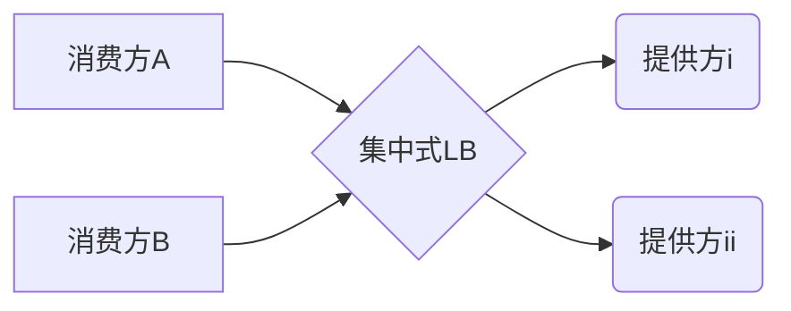

# 一、What is Ribbon

>  Spring Cloud Bibbon 是基于 Netflix Ribbon 实现的一套==客户端  负载均衡的工具==


主要功能: 提供客户端的软件负载均衡算法


> 在配置文件中列出 Load Balance (简称 LB) 后面所有的机器, Ribbon 会自动的帮助你基于某种规则 (如简单轮询, 随机连接等) 去连接这些机器. 我们也很容易使用 Ribbon 实现自定义的负载均衡算法


Spring Cloud 的负载均衡可以自定义

- 集中式 LB: 在服务的消费方和提供方之间使用独立的 LB 设置 (可以是硬件, 如 F5, 也可以是软件, 如 nginx), 由该设施负责把访问请求,通过某种策略,转发至服务的提供方



- 进程内LB: 将 LB 的逻辑集成到消费方, 消费方从服务注册中心获知有哪些地址可用, 然后自己再从这些地址中选择出一个合适的服务器.

  

==RIibbon 就属于进程内LB==, 它只是一个类库, 集成于消费方进程, 消费方通过它来获取到服务提供方的地址

- Ribbon 配置在消费方, 而不是提供方
- Ribbon 默认的负载均衡算法是简单轮询


Ribbon 如何工作

​	

- 先选择 Eureka Server, 优先选择在同一区域内负载较少的server

- 再根据用户指定的策略, 从server取到的服务祖册列表中选择一个地址.

- Ribbon 提供多种策略: 比如轮询, 随机和根据响应时间加权

   

# 二、Ribbon 配置初步

## 消费端配置

==配置位置: 消费端==

配置核心方法: 在 `RestTemplate`/`WebClient`的`Bean`方法上加上==@LoadBalanced==注解


由于消费端需要访问 Eureka Server, 所以需要添加Eureka 客户端组件


将业务类的访问地址前缀 'http://localhost:8001' 改为 `http://MICROSERVICECLOUD-DEPT` , 用服务名访问, 配合服务提供方的集群配置


相关文件

​	

​		

​	

​	

- pom.xml
- application.yml
- 配置类 ConfigBean.java
- 业务类 DeptController_Consumer.java
- 主启动类 DeptConsumer80_App.java

### pom.xml

添加 Ribbon 相关组件

```xml
        <!-- Ribbon 相关 -->
        <dependency>
            <groupId>org.springframework.cloud</groupId>
            <artifactId>spring-cloud-starter-netflix-eureka-client</artifactId>
            <version>2.0.2.RELEASE</version>
        </dependency>
        <dependency>
            <groupId>org.springframework.cloud</groupId>
            <artifactId>spring-cloud-starter-netflix-ribbon</artifactId>
            <version>2.0.2.RELEASE</version>
        </dependency>
        <dependency>
            <groupId>org.springframework.cloud</groupId>
            <artifactId>spring-cloud-starter-config</artifactId>
            <version>2.0.2.RELEASE</version>
        </dependency>
```


### application.yml

添加 eureka 相关配置

```yml
eureka:
  client:  # 客户端注册进eureka服务列表内
    register-with-eureka: false  # 不需要注册到 Eureka
    service-url:
      defaultZone: http://eureka7001.com:7001/eureka/,http:/eureka7002.com:7002/eureka/,http:/eureka7003.com:7003/eureka/

```


### 配置类 ConfigBean.java

在 `RestTemplate`/`WebClient`的Bean方法上加上`@LoadBalanced`, 将`WebClient`的地址前缀由`http://localhost:8001`,改为`http://MICROSERVICECLOUD-DEPT`

```java
@Configuration
public class ConfigBean {

    @Bean
    @LoadBalanced
    public RestTemplate getRestTemplate() {
        return new RestTemplate();
    }

    /**
     * webClient 负载均衡实现: filter 方式 
     */
    @Bean
    public WebClient getWebClient(LoadBalancerExchangeFilterFunction lbFunction) {
        return WebClient.builder().baseUrl("http://microservicecloud-dept").filter(lbFunction).build();
    }

    /**
     * webClient 负载均衡实现: WebClient.Builder + @LoadBalanced 注解方式
     */
    @Bean
    @LoadBalanced
    public WebClient.Builder loadBalancedWebClientBuilder() {
        return WebClient.builder();
    }
}
```


### 业务类

同上, 修改` DeptController_Consumer.java`的`REST_URL_PREFIX`地址前缀

```java
//    private static final String REST_URL_PREFIX = "http://localhost:8001";

    private static final String REST_URL_PREFIX = "http://MICROSERVICECLOUD-DEPT";

    /**
     * webClient 负载均衡实现: filter 方式 
     */
    @Autowired
    private WebClient webClient;

    /**
     * webClient 负载均衡实现: WebClient.Builder + @LoadBalanced 注解方式
     */
    @Autowired
    private WebClient.Builder webClientBuilder;
```


### 主启动类

需加上 Eureka 客户端注解

​			

```java
@EnableEurekaClient
@SpringBootApplication
public class DeptConsumer80_App {

    public static void main(String[] args) {
        SpringApplication.run(DeptConsumer80_App.class, args);
    }
}
```


### 测试微服务名访问

启动项目, 访问 http://microservicecloud-dept/consumer/list,


此后消费端可以直接访问服务, 而不用访问地址和端口


## 提供方集群

将原来的服务提供方`microservicecloud-provider-dept-8001`, 复制出两份,分别为

- `microservicecloud-provider-dept-8002`
- `microservicecloud-provider-dept-8003`

他们访问不同的端口和数据库, 有不同的实例名, 但是注意微服务名一定要一致, 这样三个项目将提供同一个服务, 实现提供方集群


更改主启动类的名称, 配置端口8002, 8003, 数据库分别为cloudDB02, cloudDB03, 数据库内数据不变, 更改实例名`microservicecloud-dept8002`, `microservicecloud-dept8003`, 配置示例如下

```properties
server.port=8002


# mybatis配置文件所在路径
mybatis.config-location=classpath:mybatis/mybatis.cfg.xml
# 所有Entity别名类所在包
mybatis.type-aliases-package=com.walter.springcloud.entities
# mapper映射文件
#mybatis.mapper-locations=- classpath:mybatis/mapper/**/*.xml


# 对外的微服务名称
spring.application.name=microservicecloud-dept
# 当前数据源操作类型
spring.datasource.type=com.alibaba.druid.pool.DruidDataSource
# mysql驱动包
spring.datasource.driver-class-name=com.mysql.cj.jdbc.Driver
# 数据库名称
spring.datasource.url=jdbc:mysql://192.168.184.128:3306/cloudDB02
spring.datasource.username=dev
spring.datasource.password=123456
# 数据库连接池的最小维持连接数
spring.datasource.dbcp2.min-idle=5
# 初始化连接数
spring.datasource.dbcp2.initial-size=5
# 最大连接数
spring.datasource.dbcp2.max-total=5
# 等待连接获取的最大超时时间
spring.datasource.dbcp2.max-wait-millis=200

# 客户端注册进eureka服务列表内
eureka.client.service-url.defaultZone=http://eureka7001.com:7001/eureka/,http:/eureka7002.com:7002/eureka/,\
  http:/eureka7003.com:7003/eureka/
# 自定义服务名称信息
eureka.instance.instance-id=microservicecloud-dept8002
# 访问路径可以显示IP地址
eureka.instance.prefer-ip-address=true

info.app.name=walter-microservicecloud
info.company.name=www.baidu.com
info.build.artifactId=${project.artifactId}
info.build.version=${project.version}
```


启动测试, http://eureka7001.com:7001/, 如果microservicecloud-dept 出现以下三个实例, 证明集群配置成功


## 测试负载均衡

通过消费端访问服务, http://localhost/consumer/dept/list, 如果有轮询效果, 证明 ribbon 负载均衡配置成功


# 三、Ribbon 负载均衡策略

Ribbon 自带策略

- RoundRobinRule 轮询

- RandomRule 随机

- AvailabilityFilteringRule 会先过滤掉由于多次访问故障而处于断路器跳闸状态的服务，还有并发的连接数超过阈值的服务，然后对剩余的服务列表进行轮询

- WeightedResponseTimeRule 权重 根据平均响应时间计算所有服务的权重，响应时间越快服务权重越大被选中的概率越高。刚启动时，如果统计信息不足，则使用轮询策略，等信息足够，切换到 WeightedResponseTimeRule

- RetryRule 重试 先按照轮询策略获取服务，如果获取失败则在指定时间内重试，获取可用服务

- BestAvailableRule 选过滤掉多次访问故障而处于断路器跳闸状态的服务，然后选择一个并发量最小的服务

- ZoneAvoidanceRule 符合判断server所在区域的性能和server的可用性选择服务


切换负载均衡策略, 实现`IRule`bean即可

```java
@Configuration
public class ConfigBean {

    @Bean
    @LoadBalanced
    public RestTemplate getRestTemplate() {
        return new RestTemplate();
    }

    @Bean
    public WebClient getWebClient(LoadBalancerExchangeFilterFunction lbFunction) {
        return WebClient.builder().baseUrl("http://microservicecloud-dept").filter(lbFunction).build();
    }

    @Bean
    @LoadBalanced
    public WebClient.Builder loadBalancedWebClientBuilder() {
        return WebClient.builder();
    }

    @Bean
    public IRule myRule() {
        return new RetryRule();
    }
}
```


# 四、自定义负载均衡算法

使用`@RibbonClient`注解配置自定义算法规则

```java
@RibbonClient(name = "MICROSERVICECLOUD-DEPT", configuration = MySelfRule.class)
@EnableEurekaClient
@SpringBootApplication
public class DeptConsumer80_App {

    public static void main(String[] args) {
        SpringApplication.run(DeptConsumer80_App.class, args);
    }
}
```

`name`参数表示要配置的服务名称, 这里的`MICROSERVICECLOUD-DEPT`一定要大写

`configuration`表示自定义配置的配置类


MySelfRule

```java
package com.walter.myrule;

import com.netflix.loadbalancer.IRule;
import com.netflix.loadbalancer.RandomRule;
import org.springframework.context.annotation.Bean;
import org.springframework.context.annotation.Configuration;

@Configuration
public class MySelfRule {

    @Bean
    public IRule myRule() {
        return new RandomRule();
    }
}

```


==注意, 这个配置类一定不能跟主启动类在同一个包下==


**Ribbon 会优先使用注解配置的算法**


自定义算法, 在`RandomRule`的基础上更改

```java
package com.walter.myrule;

import com.netflix.client.config.IClientConfig;
import com.netflix.loadbalancer.AbstractLoadBalancerRule;
import com.netflix.loadbalancer.ILoadBalancer;
import com.netflix.loadbalancer.Server;

import java.util.List;

/**
 * 实现每个实例访问五次后, 再轮询
 *
 */
public class RandomRule_ZY extends AbstractLoadBalancerRule {

    private int index = 0;
    private int total = 0;
    /**
     * Randomly choose from all living servers
     */
    public Server choose(ILoadBalancer lb, Object key) {
        if (lb == null) {
            return null;
        }
        Server server = null;

        while (server == null) {
            if (Thread.interrupted()) {
                return null;
            }
            List<Server> upList = lb.getReachableServers();
            List<Server> allList = lb.getAllServers();

            int serverCount = allList.size();
            if (serverCount == 0) {
                /*
                 * No servers. End regardless of pass, because subsequent passes
                 * only get more restrictive.
                 */
                return null;
            }

//            int index = rand.nextInt(serverCount);
//            server = upList.get(index);

            if (total < 5) {
                total++;
                server = upList.get(index);
            } else {
                total = 1;
                index = index < serverCount - 1 ? ++index : 0;
                server = upList.get(index);
            }

            if (server == null) {
                /*
                 * The only time this should happen is if the server list were
                 * somehow trimmed. This is a transient condition. Retry after
                 * yielding.
                 */
                Thread.yield();
                continue;
            }

            if (server.isAlive()) {
                return (server);
            }

            // Shouldn't actually happen.. but must be transient or a bug.
            server = null;
            Thread.yield();
        }

        return server;

    }

    @Override
    public Server choose(Object key) {
        return choose(getLoadBalancer(), key);
    }

    @Override
    public void initWithNiwsConfig(IClientConfig clientConfig) {
        // TODO Auto-generated method stub

    }
}

```


